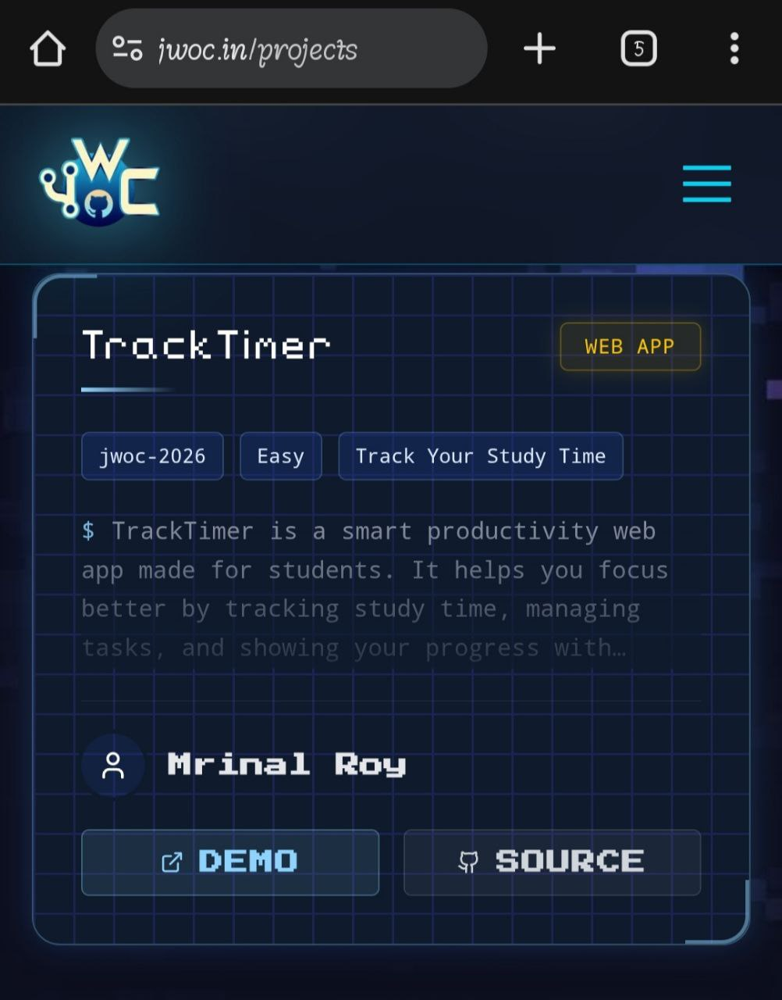

## 📌 Open Source Program

**This project is officially accepted for:**


---

## 🏆 Official Recognition – JWoC 2026

TrackTimer has been officially accepted and listed on the  
**JGEC Winter of Code 2026 (JWoC 2026)** projects page.

<p align="center">
  
</p>

This recognition marks the beginning of its open-source journey 🚀

---

⚡ TrackTimer – Your Personalised Study Timer

Stay productive. Build habits. Track progress. Achieve more.

TrackTimer is a clean, minimal and powerful web-based productivity timer designed to help students stay focused, build consistent study habits, and visualize their progress like GitHub contributions.

🌐 Live Demo: https://tracktimer-teamxvirus.netlify.app

🚀 Features

⏳ Custom Study Timer – Set your own focus duration

📊 Progress Tracking – Visualize daily consistency

🔥 Day Streak Counter – Build long-term discipline

🌙 Dark / Light Mode Toggle

🔐 Sign In / Sign Up System

📈 Analytics Dashboard

🎯 Clean, distraction-free UI

## 🧠 Tech Stack

| Layer      | Technology |
|------------|------------|
| Frontend   | HTML5 |
| Styling    | CSS3 (Custom Properties) |
| Logic      | JavaScript (Vanilla JS) |
| Storage    | LocalStorage API |
| Deployment | Netlify / GitHub Pages |
## 📂 Folder Structure

```
TrackTimer/
│
├── index.html          # Landing page
├── dashboard.html      # User dashboard
├── analytics.html      # Progress analytics
├── signin-signup.html  # Authentication page
│
├── css/
│   ├── landing.css
│   ├── dashboard.css
│   ├── analytics.css
│   └── signin-signup.css
│
├── js/
│   ├── landing.js
│   ├── dashboard.js
│   ├── analytics.js
│   ├── signin-signup.js
│   └── theme.js
│
└── .github/workflows/
```

---

## 🤝 Contributing to TrackTimer

Thank you for your interest in contributing to **TrackTimer** 🚀  
We welcome developers of all experience levels.

---

### ⭐ How to Contribute?

1. Star this repository.
2. Check existing Issues.
3. Raise a new issue if needed.
4. Wait until assigned.
5. Create a separate branch.
6. Submit a Pull Request.

---

### 📌 Contribution Rules

- Do not work without being assigned.
- Do not work on more than **3 issues at a time**.
- Always create a new branch for every PR.
- Keep commits clean and meaningful.
- Do not modify unrelated files.
- Add screenshots for UI changes.

---

## 🛠️ Installation & Setup

TrackTimer is a static web project.

### Clone the Repository

```bash
git clone https://github.com/Mrinalray/TrackTimer.git
## 🔀 How to Make a Pull Request

### 1️⃣ Fork the Repository

Click the **Fork** button at the top right of this repository.

---

### 2️⃣ Clone Your Fork

```bash
git clone https://github.com/<your-username>/TrackTimer.git
3️⃣ Add Upstream Remote
git remote add upstream https://github.com/Mrinalray/TrackTimer.git
4️⃣ Create a New Branch
git checkout -b feature/your-feature-name
5️⃣ Make Your Changes

Work only on the assigned issue and keep your changes clean.
6️⃣ Stage Specific Files & Commit
git add file-name
git commit -m "Describe your changes clearly"
7️⃣ Push Your Changes
git push origin feature/your-feature-name
8️⃣ Create a Pull Request

Go to your forked repository on GitHub and click
Compare & Pull Request to submit your PR for review.
